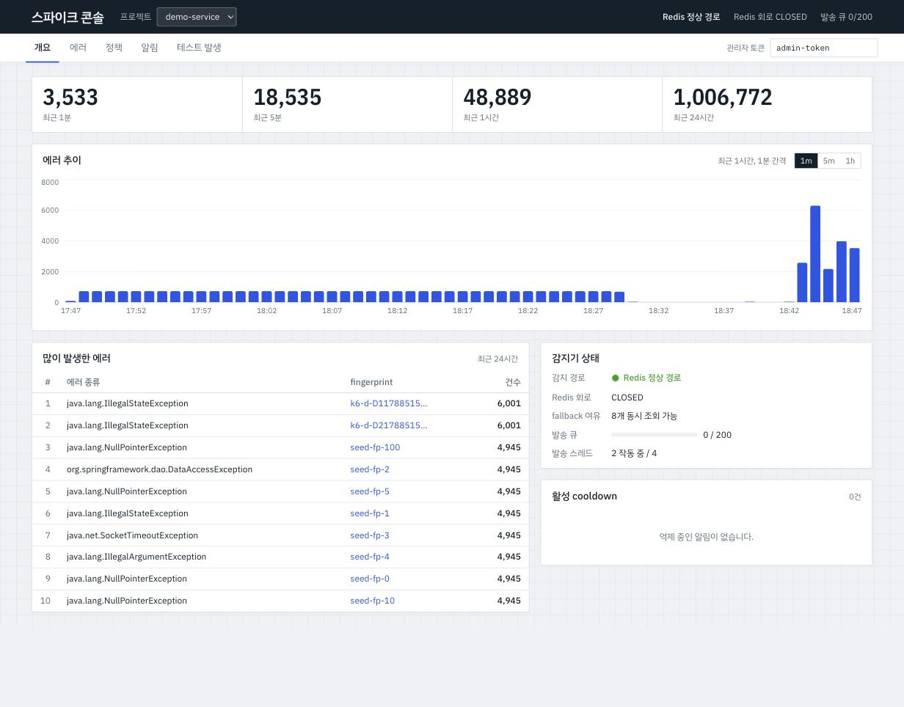
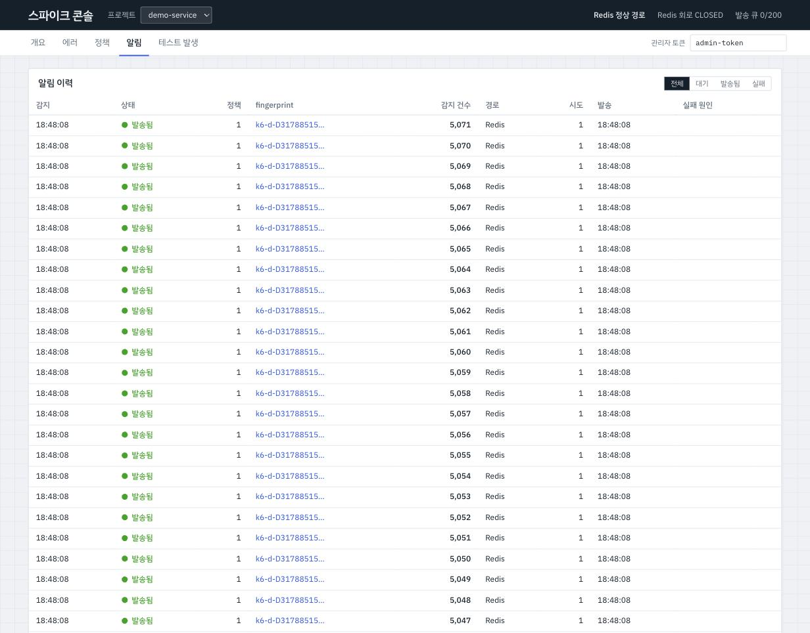

# error-spike-alert — 에러 급증 실시간 감지·알림 시스템

MySQL에 에러 이력을 남기면서 Redis 1초 버킷 슬라이딩 윈도우로 급증을 감지하고, Redis가 죽으면 timestamp 복합 인덱스 기반 DB 집계로 감지를 이어가며, 원자적 cooldown으로 알림 폭주를 막는 백엔드. 모든 설계 선택은 같은 조건의 실험으로 검증했고, 이 README의 수치는 전부 실측값이다.



| 항목 | 값 |
|---|---|
| 스택 | Java 21 · Spring Boot 3.5 · Spring Data JPA/Redis · Spring Retry · MySQL 8 · Redis 7 · Micrometer/Prometheus/Grafana · k6 · Testcontainers · React/Vite/TanStack Query/Recharts |
| 문서 | [설계(22장)](docs/DESIGN.md) · [ADR 7건](docs/adr/README.md) · [실측 결과](docs/experiments/results.md) · [장애 실험](docs/experiments/failure-scenarios.md) · [트러블슈팅](docs/troubleshooting.md) · [면접 Q&A](docs/interview-qa.md) |
| 테스트 | Testcontainers(MySQL 8 + Redis 7) 통합 테스트 19개, `./gradlew test` 약 30 s |

## 1. 문제: DB `COUNT`로 감지하면 생기는 병목

"최근 60초 동안 같은 에러가 20건 이상"을 판단하는 가장 단순한 방법은 이벤트가 올 때마다 `SELECT COUNT(*) … WHERE received_at >= now − 60s`를 실행하는 것이다. 이벤트 100만 건이 쌓인 테이블에서 시간축 인덱스가 없으면 이 쿼리 하나가 전체 행을 읽는다.

| | 인덱스 없음 | `(project_id, environment, fingerprint, received_at)` |
|---|---:|---:|
| 실행 계획 | `Index lookup on uk_ee_project_event (project_id=1)` → 100만 행 필터 | `Covering index range scan` |
| 실제 시간 (EXPLAIN ANALYZE, 60 s 창) | 696 ms | 1.1 ms |
| `Handler_read_next` | 1,000,043 | 20 |
| 24 h 창 (4,956건 대상) | 416 ms | 4.9 ms |

인덱스를 붙이면 단일 쿼리는 빨라지지만 "이벤트마다 DB 범위 집계"라는 구조 자체는 남는다. 부하 실험(§9 실험 B)에서 같은 100 RPS를 인덱스 없는 DB 집계로 처리하면 API p95가 **1,009 ms**(쿼리 타임아웃에 걸림, 감지 98 % 생략, MySQL 7.7코어)였고, 인덱스를 붙인 DB 집계는 **8.0 ms**, Redis 집계는 **9.3 ms**였다. 인덱스가 있으면 지연은 같아지지만 DB CPU(13.5 % vs 10.0 %)를 쓰고, 다중 인스턴스에서는 1초 캐시 구간만큼 과소 집계된다. Redis를 쓰는 이유는 "더 빠르다"가 아니라 "DB를 건드리지 않고 인스턴스 간 정확한 집계를 준다"에 있다.

## 2. Redis 실시간 집계

Redis에 정책·fingerprint별 HASH 하나(`ec:{policyId}:{fp}`)를 두고 field를 epoch 초로 쓴다. Lua 스크립트 한 번이 `HINCRBY(현재 초)` → 윈도우 밖 field `HDEL` → 남은 값 합산 → `EXPIRE`를 원자적으로 수행한다.

- `INCR + EXPIRE`는 분 단위 고정 창이라 59초에 19건 + 다음 창 1초에 19건이면 감지를 놓친다. 이건 슬라이딩 윈도우가 아니다.
- ZSET은 정확하지만 이벤트마다 멤버를 저장해 급증 순간에 키가 가장 커진다(1,000 RPS × 60 s ≈ 6만 멤버).
- 1초 버킷은 오차 1초(60초 창의 1.7 %), 메모리는 트래픽과 무관(field ≤ 60개), hot key도 약하다. 그래서 문서 전체에서 **"1초 버킷 슬라이딩 윈도우(근사)"**라고 부른다. → [ADR-001](docs/adr/001-window-algorithm.md)

쓰기 순서는 **MySQL INSERT → Redis 집계**다. 원본 없는 카운트를 만들지 않기 위해서고, 그 결과 허용되는 오차는 "과소 집계"뿐이다(과대 = 오탐은 없음). → [ADR-002](docs/adr/002-write-order-mysql-first.md)

## 3. Redis가 죽으면 생기는 문제

Redis만 믿으면 Redis 장애 = 감지 중단이고, cooldown 키도 함께 사라져 복구 직후 알림이 중복될 수 있다. 반대로 "Redis가 죽으면 무조건 DB로 COUNT"는 Redis 장애를 DB 장애로 바꾼다. 에러가 폭주하는 순간(=fallback이 필요한 바로 그 순간)에 커넥션 풀 10개가 COUNT에 잠식되면 INSERT까지 밀려 수집 전체가 느려진다.

## 4. DB fallback 설계

| 장치 | 역할 |
|---|---|
| Redis breaker (실패 시 5 s OPEN → 1회 probe) | 매 요청이 200 ms 타임아웃을 기다리지 않게 |
| fallback 세마포어 8 | 커넥션 풀 10 중 최소 2개는 INSERT 몫 |
| 같은 (정책, fingerprint) 1초 로컬 캐시 + 로컬 증가 | 같은 에러 폭주를 DB 1 QPS로 축소 |
| `MAX_EXECUTION_TIME(1000)` | 느린 COUNT가 스레드를 잡지 않게 |
| degraded mode | 위를 넘으면 그 이벤트의 감지만 생략(`SKIPPED`)하고 **수집은 계속** |

실제 Redis를 `docker compose stop`한 장애 실험에서 정지 후 fallback 전환까지 **303 ms**, 재기동 후 Redis 경로 복귀까지 **5.7 s**(breaker OPEN 5 s + probe), 그 사이 수집 오류율 **0 %**, 유실 이벤트 **0건**이었다. Redis를 `docker pause`로 3초 멈춘 경우도 전환 192 ms, 복귀 2.3 s, 오류 0이었다. → [ADR-004](docs/adr/004-fallback-guard.md), [장애 실험](docs/experiments/failure-scenarios.md)

## 5. 임계값을 넘은 채로 에러가 계속 오면 알림이 폭주한다

cooldown 없이 임계값 감지만 하면 20건째부터 모든 이벤트가 알림이다. 100 RPS × 60초 실험에서 **5,978건**의 알림이 나갔다.



## 6. 원자적 cooldown

`SET cd:{policyId}:{fp} NX EX {cooldown}` 한 명령으로 "알림 권한"을 얻는다. Redis가 명령을 직렬화하므로 동시에 100개 요청이 임계값을 넘어도 하나만 `OK`를 받는다(100 스레드 동시성 테스트로 검증). Redis가 없을 때를 위해 `alert_histories.dedup_key = {policy}:{fp}:{floor(epochSec / cooldown)}`에 UNIQUE 제약을 두어 DB가 최종 방어선이 된다.

같은 조건에 cooldown 30초를 적용하면 알림은 **2건**(감소율 **99.97 %**), 차단된 알림 **5,980건**, webhook 중복 수신 **0건**, cooldown 만료 30초 뒤 재알림 **있음(t+0.2 s, t+30.2 s에 각 1건)**. → [ADR-003](docs/adr/003-cooldown-atomic-and-db-guard.md)

## 7. 비동기 발송과 제한적 재시도

`ThresholdEvaluator → AlertDispatcher(@Async) → AlertSender(@Retryable)` 세 클래스로 나눴다. 같은 클래스 안에서 `this.method()`를 부르면 프록시를 거치지 않아 `@Async`도 `@Retryable`도 동작하지 않기 때문이다. Executor는 core 4 / max 8 / queue 200 / `AbortPolicy`(거부 시 `FAILED(EXECUTOR_SATURATED)` 기록). `CallerRunsPolicy`는 수집 스레드가 webhook을 기다리게 만들어 배제했다. 재시도는 5xx·429·408·타임아웃만 3회(500 ms × 2), 4xx는 즉시 실패, 429 `Retry-After`는 5초까지 존중, `Idempotency-Key: alert-{id}`로 수신 측 멱등.

알림 서버가 50 % 확률로 500을 내는 실험(3회)에서 재시도 전 성공률 **51.1 %** → 발송된 알림의 최종 성공률 **87.6 %**(이론값 1−0.5³ = 87.5 %), 3회 연속 실패 12.5 %는 FAILED로 남아 수동 retry 대상, 중복 발송 **0건**(timeout 모드에서도 0), 그동안 수집 API p95는 **5.9–8.2 ms**(장애 없을 때 6.0 ms)로 채널 장애가 수집으로 전파되지 않았다. 다만 T=5·cooldown 0으로 초당 50건 알림을 만든 극단 조건에서는 큐 200이 차서 61 %가 `EXECUTOR_SATURATED`로 즉시 실패했다 — cooldown이 알림 양을 제한하는 것이 이 구조의 전제다. → [ADR-005](docs/adr/005-async-retry-and-its-limit.md)

## 8. 같은 조건에서 실험했다

- 사양·JVM·MySQL·Redis·데이터셋(100만 건 시드)을 [environment.md](docs/experiments/environment.md)에 고정.
- k6 스크립트 5종(`load/k6/`)과 러너(`load/run-experiment.sh`)가 반복 실행 후 중앙값 ± 표준편차를 계산.
- Redis vs DB 비교는 breaker 강제 OPEN으로 "같은 데이터·같은 요청"에 경로만 바꿨고, 인덱스 없음 조건은 시간축 인덱스 3개를 실제로 DROP했다.
- 장애 실험은 컨테이너 stop/pause, `DEBUG SLEEP`, 테이블 락, `kill -9`로 직접 재현했다.

## 9. 실제 개선 수치

실험 B — 같은 100 RPS, 1분, n=5 (중앙값)

| 지표 | Redis 정상 | DB fallback (인덱스 有) | DB fallback (인덱스 無) |
|---|---:|---:|---:|
| 집계 p95 | 0.98 ms | 0.96 ms | 1,018 ms |
| API p95 | 9.3 ms | 8.0 ms | 1,009 ms |
| API p99 | 25.3 ms | 29.3 ms | 1,028 ms |
| TPS | 100.0 | 100.0 | 98.5 |
| MySQL CPU (avg) | 10.0 % | 13.5 % | 772 % (≈7.7코어) |
| 감지 SKIPPED | 0 | 0 | 5,911 / 6,005 (98 %) |
| 오류율 | 0 % | 0 % | 0 % |

인덱스 있는 fallback이 Redis와 같은 지연을 낸 이유는 fallback의 1초 로컬 캐시가 같은 fingerprint의 두 번째 이벤트부터 DB를 치지 않기 때문이다(fingerprint 50개·100 RPS → 캐시 히트 약 50 %). 그 대가는 MySQL CPU와 다중 인스턴스 정확도다. 인덱스 없는 fallback은 세마포어 8개가 항상 1초 타임아웃에 걸려 p95가 곧 타임아웃 값이 됐지만, INSERT는 계속돼 오류율 0 %를 지켰다(감지를 포기하고 수집을 지키는 degraded 설계).

실험 D — W=60 s, T=20, 100 RPS × 60 s, 단일 fingerprint, n=5

| 지표 | Cooldown 없음 | Cooldown 30 s | 개선 |
|---|---:|---:|---:|
| 발송 시도 | 5,978 | 2 | −99.97 % |
| 실제 알림(webhook unique) | 5,978 | 2 | −99.97 % |
| 중복 알림(webhook duplicates) | 0 | 0 | — |
| 알림 발송 p95 | 15 ms | 11 ms | −4 ms |

감지 지연(실험 A, 임계값 도달 이벤트 수신 → webhook 도착): p50 **13.0 ms**, p95 **20.0 ms**, p99 **21.0 ms**. 수집 API(실험 C, 100 RPS 지속): p95 **6.0 ms**, p99 **23.8 ms**, 램프 결과 **200 RPS부터 HikariCP 풀(10개)이 포화되어(pending 39) 서버 측 p95가 6 ms → 101 ms, 500 RPS에서 378 ms**. 전체 표는 [results.md](docs/experiments/results.md).

> **이력서 문장**: MySQL 이력 저장과 Redis 실시간 집계를 결합한 에러 급증 감지 시스템을 구현했습니다. Redis 장애 시 timestamp 복합 인덱스를 활용한 DB fallback을 적용하여 감지 기능을 유지했고, 원자적 cooldown을 통해 초당 100건의 에러 유입 상황에서 중복 알림을 5,978건에서 2건으로 감소시켰습니다. 또한 Redis 경로와 DB fallback 경로의 p95를 각각 9.3 ms와 8.0 ms(시간축 인덱스가 없으면 1,009 ms)로 측정해 성능과 가용성의 트레이드오프를 검증했습니다.

## 10. 현재 구조의 한계와 확장안

| 한계 (실측으로 확인) | 확장안 | 도입 조건 |
|---|---|---|
| `@Async` 큐는 JVM 힙 — `kill -9` 실험에서 큐에 있던 PENDING **135건이 100 % 유실**, 재시작 후에도 그대로 남고 retry API는 FAILED만 받아 자동 복구 경로가 없음 | `alert_histories.status=PENDING` 자체를 outbox로 쓰는 폴러(`FOR UPDATE SKIP LOCKED`) | PENDING 유실이 운영에서 실제로 문제될 때 |
| 재시도 중복 | 수신 측 멱등 키(적용됨) | — |
| 단일 MySQL INSERT — 램프 실험에서 **200 RPS부터 HikariCP 풀(10개)이 포화되어(pending 39) 서버 측 p95가 6 ms → 101 ms, 500 RPS에서 378 ms** | 이벤트 비동기 저장(배치) → Kafka로 수집·저장 분리 | INSERT p95가 SLA를 넘을 때. 브로커 운영·소비 지연이라는 새 장애점 |
| Redis hot key — 단일 fingerprint 1,000 RPS에서 Redis CPU **5.5 % (알림 1건, SUPPRESSED 9,981)** | 키 샤딩 / Redis Cluster | 단일 키 ops가 Redis CPU를 점유할 때 |
| fallback 중 DB COUNT | 세마포어·캐시(적용됨), Sentinel/Cluster로 fallback 빈도 자체를 축소 | — |
| Stack Trace 저장 비용 | S3 아카이빙 + 파티션 DROP 보관 정책 | 디스크·삽입 시간이 문제될 때 |
| 정적 임계값 | fingerprint별 동적 임계값, 평균 대비 급증 탐지 | 오탐·미탐 민원 |

## 실행

```bash
docker compose up -d                                   # MySQL 3307 / Redis 6380 / webhook 8091 / Prometheus 9091 / Grafana 3001
cd backend && ./gradlew bootJar && java -Xms1g -Xmx1g -jar build/libs/error-spike-alert-0.1.0.jar   # 앱 8090
cd frontend && npm install && npm run dev               # 대시보드 5173
curl -X POST localhost:8090/api/errors -H 'X-API-Key: demo-api-key' -H 'Content-Type: application/json' \
  -d '{"environment":"PRODUCTION","errorType":"java.lang.NullPointerException","fingerprint":"demo","message":"boom"}'
```

관리 API는 `X-Admin-Token: admin-token`. 실험은 `load/README.md`, Grafana는 `http://localhost:3001/d/spike-alert`.

## 구조

```
backend/   Spring Boot — project / error / alert / common 모듈형 모놀리스 (DESIGN §12)
frontend/  React 운영 콘솔 (개요·에러·정책·알림·테스트 발생)
mock-webhook/  Node 단일 파일 알림 서버 (ok/500/429/timeout/slow/close, 멱등 키 중복 집계, /metrics)
load/      k6 실험 A–E, 러너, 장애 시나리오 스크립트, 시드·EXPLAIN SQL, 결과
monitoring/ Prometheus 설정, Grafana 프로비저닝·대시보드
docs/      설계, ADR, 실측 결과, 장애 실험, 트러블슈팅, 면접 Q&A
```
