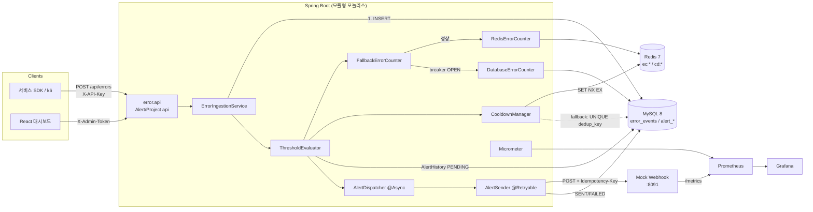
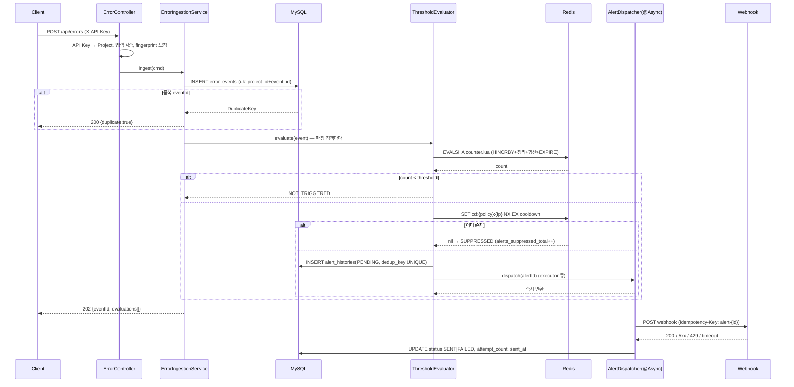
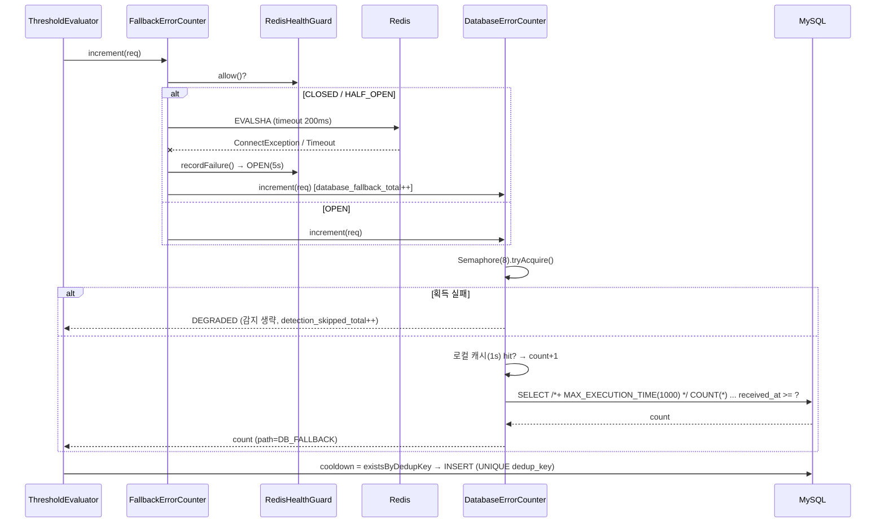
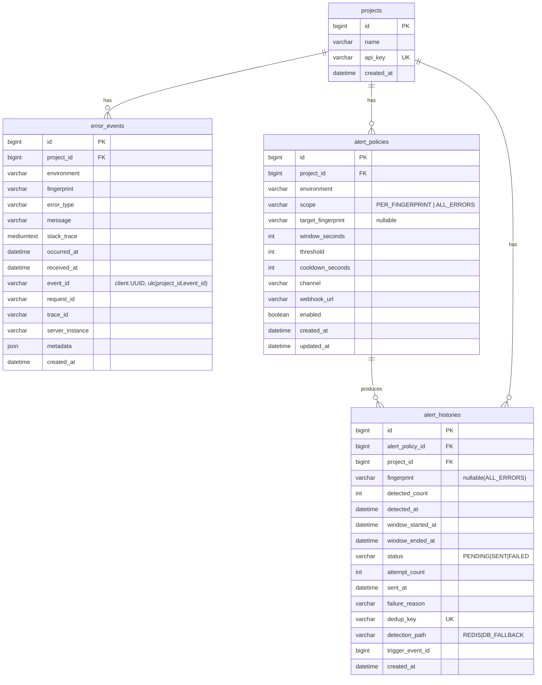

# 에러 급증 실시간 감지·알림 시스템 — 설계 문서

> 이 문서는 구현의 계약(contract)이다. 코드가 이 문서와 다르면 코드가 틀린 것이거나, 이 문서를 고치고 ADR을 남긴다.
> 수치는 "예상값"과 "실측값"을 반드시 구분한다. 실측값은 `docs/experiments/results.md`에만 기록한다.

---

## 1. 프로젝트 정의

**한 줄 정의**: 여러 서비스가 보내는 에러 이벤트를 MySQL에 영속 저장하면서, Redis 1초 버킷 슬라이딩 윈도우로 fingerprint별 급증을 실시간 감지하고, Redis 장애 시 timestamp 복합 인덱스 기반 DB 집계로 감지를 이어가며, 원자적 cooldown으로 알림 폭주를 막는 시스템.

**해결하는 문제**

| 문제 | 원인 | 이 시스템의 답 |
|---|---|---|
| DB `COUNT` 감지의 부하·지연 | 이벤트마다 시간 범위 스캔 | Redis 카운터 O(window) 연산, DB는 이력만 |
| Redis 단독 구성의 취약성 | 이력 없음·장애 시 감지 중단 | MySQL이 원본, Redis는 파생 캐시. 장애 시 DB fallback |
| 임계값 초과 중 알림 반복 | 상태 없는 감지 | `SET NX EX` 원자적 cooldown + DB UNIQUE 최종 방어선 |
| 알림 채널 일시 장애 | 동기 발송 | `@Async` 분리 + `@Retryable` 제한 재시도 + 멱등 키 |
| 장애 전파 | fallback이 DB를 두 번 죽임 | 세마포어·쿼리 타임아웃·로컬 캐시·degraded mode |

**역할 분담**

| 저장소 | 책임 |
|---|---|
| MySQL | 에러 원본 이력, 추이 조회, fallback 집계, 알림·실패 이력, 감사 데이터, cooldown 최종 방어(UNIQUE) |
| Redis | 1초 버킷 카운터(HASH), 임계값 판정, cooldown 키(`SET NX EX`), 실시간 상태 |

**범위 밖(명시)**: 멀티 테넌트 인증/인가 체계, 알림 채널 다양화(Slack/Email — Webhook 하나로 추상화), 메시지 브로커(19장 확장에서만 검토).

---

## 2. 기능·비기능 요구사항

### 기능 요구사항

| ID | 요구사항 | 검증 |
|---|---|---|
| F1 | `POST /api/errors`로 이벤트 수집, API Key 검증 | 통합 테스트 |
| F2 | 동일 `eventId` 재전송 시 중복 저장·중복 카운트 없음(멱등) | 통합 테스트 |
| F3 | 정책(환경·범위·임계값·cooldown·채널) CRUD | 통합 테스트 |
| F4 | 윈도우 내 카운트 ≥ 임계값이면 알림, cooldown 중이면 억제 | 임계값 테스트 |
| F5 | 다중 인스턴스·다중 스레드에서 동일 알림 정확히 1건 | 100 스레드 동시성 테스트 |
| F6 | Redis 장애 시 DB 집계로 감지 지속, 복구 시 자동 복귀 | Testcontainers Redis pause |
| F7 | 알림 비동기 발송, 5xx/타임아웃 재시도, 4xx 즉시 실패, 이력 기록 | Mock Webhook 테스트 |
| F8 | 추이·목록·상세·알림 이력 조회 API와 대시보드 | 수동 + E2E |

### 비기능 요구사항 (목표는 "예상값", 실측은 `results.md`)

| ID | 항목 | 목표(예상) | 측정 |
|---|---|---|---|
| N1 | 수집 API p95 (100 RPS, Redis 정상) | < 30 ms | k6 실험 C |
| N2 | 감지 지연 p95 (임계값 도달 → webhook 수신) | < 500 ms | 실험 A |
| N3 | Redis 장애 시 fallback 전환 | 첫 실패 요청부터 즉시(단일 요청 단위), 복귀 탐지 ≤ 5 s | 실험 B·장애 실험 |
| N4 | 중복 알림 | 0건 (동일 policy·fingerprint·cooldown 슬롯) | 실험 D |
| N5 | fallback 중 DB 동시 COUNT | ≤ 8 (세마포어) | 장애 실험 |
| N6 | 알림 채널 장애 시 API p95 영향 | 없음 (비동기 분리) | 실험 E |

---

## 3. 전체 아키텍처



**에러 한 건의 여정** (정상 경로)



**Redis 장애 fallback 경로**



---

## 4. ERD와 MySQL DDL



DDL 전문은 `backend/src/main/resources/schema.sql`. 핵심 결정:

| 결정 | 근거 |
|---|---|
| `received_at`을 시간 인덱스 컬럼으로 채택 (`occurred_at`은 표시용) | 감지·추이 모두 서버 시계 기준. 클라이언트 시계 편차·지연 도착 이벤트가 과거 버킷을 바꾸지 않음. Redis 경로와 DB 경로의 기준 시각이 동일 → 결과 비교 가능. §8 참조 |
| `event_id VARCHAR(36)` + `UNIQUE(project_id, event_id)` | 멱등성 키. `request_id`는 한 요청에서 여러 에러가 날 수 있어 이벤트 식별자로 부적합 |
| `fingerprint VARCHAR(64)` | 서버 생성 시 SHA-256 앞 32 hex, 클라이언트 지정 허용(최대 64) |
| `alert_histories.dedup_key UNIQUE` | Redis 없이도 중복 알림을 막는 최종 방어선 (§9) |
| `metadata JSON` | 스키마 없는 부가 정보. 조회 조건으로 쓰지 않음(인덱스 없음) |
| `stack_trace MEDIUMTEXT` | 최대 16 MB. 대량 저장 비용은 §19 아카이빙으로 |
| `DATETIME(3)` | ms 정밀도. TIMESTAMP(2038 한계, TZ 변환) 대신 UTC 고정 |

---

## 5. 인덱스 설계

`error_events` (쓰기 1 : 읽기 소수, 삽입 성능이 중요)

| 인덱스 | 사용하는 쿼리 | 순서·카디널리티 근거 |
|---|---|---|
| `PRIMARY(id)` | 상세 조회 | AUTO_INCREMENT → 삽입 순서 = 시간 순서, 페이지 분할 최소 |
| `uk_ee_project_event (project_id, event_id)` | 멱등성 INSERT | event_id는 UUID로 매우 높은 카디널리티. project_id 선두로 파티션 효과 |
| `idx_ee_project_received (project_id, received_at)` | 프로젝트 추이, 목록 기본 정렬, 1m/5m/1h/24h 집계 | 등치(project) → 범위(시간). 범위 컬럼은 항상 마지막 |
| `idx_ee_project_env_received (project_id, environment, received_at)` | 환경별 추이, `ALL_ERRORS` 정책 fallback COUNT | environment 카디널리티 4로 낮지만 등치 조건이므로 선두 뒤에 두면 범위 스캔 폭이 1/4로 줄어듦 |
| `idx_ee_project_env_fp_received (project_id, environment, fingerprint, received_at)` | **fallback COUNT**, fingerprint별 목록 | 모든 등치 컬럼 뒤에 범위 → 인덱스만으로 COUNT 가능(covering). fingerprint 카디널리티가 높아 examined rows ≈ 실제 윈도우 내 건수 |
| `idx_ee_request (request_id)` | 요청 ID로 추적 | 운영 조회용. 삽입 비용 대비 가치가 낮으면 제거 후보 (실험 C에서 삽입 성능 비교) |

스펙 원안의 `(project_id, fingerprint, occurred_at)` 대신 `environment`를 끼운 이유: fallback 쿼리의 WHERE가 `project_id, environment, fingerprint, received_at`이므로 원안 인덱스로는 environment를 인덱스 탐색 후 필터링해야 하고, 같은 fingerprint가 여러 환경에서 나오면 examined rows가 늘어난다. 환경별 fingerprint 목록 조회에도 동일 인덱스가 쓰인다. 반대로 "환경 무관 fingerprint 추이"는 `(project_id, received_at)` 범위 스캔 후 필터로 처리한다(대시보드용, 빈도 낮음).

`alert_histories`

| 인덱스 | 사용 |
|---|---|
| `uk_ah_dedup (dedup_key)` | cooldown 최종 방어선 |
| `idx_ah_policy_detected (alert_policy_id, detected_at)` | 정책별 알림 이력, fallback cooldown 조회 |
| `idx_ah_project_detected (project_id, detected_at)` | 프로젝트 알림 목록 |

**인덱스 전후 비교 방법** (실험 B에 포함)

```sql
-- 전
EXPLAIN ANALYZE SELECT COUNT(*) FROM error_events
 WHERE project_id=1 AND environment='PRODUCTION' AND fingerprint='...' AND received_at >= NOW(3) - INTERVAL 60 SECOND;
-- "인덱스 없음" 기준선: received_at 복합 인덱스 3개를 모두 지운다.
-- idx_ee_project_env_fp_received 하나만 지우면 옵티마이저가 idx_ee_project_env_received 로 우회(range + fingerprint 필터)해 full scan 이 재현되지 않는다 (EXPLAIN ANALYZE 로 확인).
ALTER TABLE error_events
  DROP INDEX idx_ee_project_env_fp_received,
  DROP INDEX idx_ee_project_env_received,
  DROP INDEX idx_ee_project_received;
-- 후 동일 쿼리 → rows examined, actual time, Using index 여부 비교
```

`load/sql/drop-fallback-index.sql`, `add-fallback-index.sql`, `explain-fallback.sql` 제공. 데이터 규모별 예상(실측 아님):

| 건수 | 인덱스 없음 (full scan) | 인덱스 있음 (range on covering idx) |
|---|---|---|
| 10만 | 수십 ms, examined 100k | < 1 ms, examined ≈ 윈도우 내 건수 |
| 100만 | 수백 ms | < 1 ms |
| 1,000만 | 수 초, 버퍼풀 초과 시 I/O | 1–3 ms (B-tree 깊이 +1), 인덱스 크기 ≈ 1 GB |

삽입 성능: 보조 인덱스 5개 → 삽입마다 5개 B-tree 갱신. `received_at`이 단조 증가라 각 인덱스의 우측 끝에 append되어 change buffer 효과가 큼. 실험 C에서 인덱스 5개 vs PK만 삽입 p95를 비교한다.

---

## 6. API 명세

**인증 분리**

| 구분 | 헤더 | 이유 |
|---|---|---|
| 수집 API (`POST /api/errors`) | `X-API-Key: <project api_key>` | 클라이언트 서비스에 배포되는 키. 쓰기 전용, 해당 프로젝트만 |
| 조회·관리 API | `X-Admin-Token: <설정값>` | 대시보드 운영자. 수집 키가 유출돼도 이력 열람·정책 변경 불가 |

공통 응답 봉투

```json
{ "success": true, "data": {...} }
{ "success": false, "error": { "code": "POLICY_NOT_FOUND", "message": "..." } }
```
(`null` 필드는 직렬화에서 생략한다. 클라이언트는 `error: null`의 존재에 의존하지 않는다.)

에러 코드: `INVALID_API_KEY`(401) · `INVALID_ADMIN_TOKEN`(401) · `VALIDATION_FAILED`(400) · `PROJECT_NOT_FOUND`/`POLICY_NOT_FOUND`/`ERROR_NOT_FOUND`/`ALERT_NOT_FOUND`(404) · `ALERT_NOT_RETRYABLE`(409) · `INTERNAL_ERROR`(500)

페이지네이션: `page`(0-base), `size`(≤200), 정렬은 API마다 고정(시간 역순). 응답 `{content, page, size, totalElements}`.

### POST /api/errors → 202 Accepted (중복이면 200)

```http
X-API-Key: demo-api-key
Content-Type: application/json
{
  "eventId": "9f1c...uuid (선택, 없으면 서버 생성)",
  "environment": "PRODUCTION",
  "errorType": "java.lang.NullPointerException",
  "fingerprint": "선택. 없으면 서버가 errorType+정규화 message+최상위 프레임으로 생성",
  "message": "Cannot invoke ... on null",
  "stackTrace": "선택",
  "occurredAt": "2026-09-04T10:00:00.123Z",
  "requestId": "req-1", "traceId": "trace-1", "serverInstance": "api-2",
  "metadata": { "userId": 42 }
}
```

응답: `{ "errorId": 123, "eventId": "...", "fingerprint": "...", "duplicate": false, "receivedAt": "...", "evaluations": [ { "policyId": 1, "count": 21, "threshold": 20, "result": "TRIGGERED|NOT_TRIGGERED|SUPPRESSED|SKIPPED", "path": "REDIS|DB_FALLBACK|NONE", "alertId": 7 } ] }`

`projectId`는 바디가 아니라 API Key로 결정한다(위조 방지).

### GET /api/errors (Admin)
쿼리: `projectId*`, `environment`, `fingerprint`, `requestId`, `from`, `to`, `page`, `size`. 정렬 `received_at DESC`. 응답 항목은 stackTrace 제외(상세에서만).

### GET /api/errors/trend (Admin)
쿼리: `projectId*`, `environment`, `fingerprint`, `from`, `to`, `interval=1m|5m|1h`. 응답 `{ buckets: [{ts, count}], recent: {"1m":n,"5m":n,"1h":n,"24h":n}, topFingerprints: [{fingerprint, errorType, count}] }` (`recent`·`top`은 `from/to`와 무관하게 현재 기준).

### GET /api/errors/{errorId} (Admin) → stackTrace, metadata 포함 전체.

### POST /api/alert-policies (Admin) → 201
```json
{ "projectId":1, "environment":"PRODUCTION", "scope":"PER_FINGERPRINT", "targetFingerprint":null,
  "windowSeconds":60, "threshold":20, "cooldownSeconds":300, "channel":"WEBHOOK",
  "webhookUrl":"http://mock-webhook:8091/webhook", "enabled":true }
```
검증: window 1–3600, threshold ≥ 1, cooldown 0–86400, channel ∈ {WEBHOOK}.
GET (`projectId`) / PATCH(부분 수정, 같은 필드) / DELETE → 204 (`alert_histories` FK 때문에 행을 지우지 않고 `enabled=false`로 비활성화한다. 이력의 정책 참조가 끊기지 않는다).

### GET /api/alerts (Admin)
쿼리: `projectId*`, `policyId`, `status`, `page`, `size`. 정렬 `detected_at DESC`.
항목: `{id, policyId, fingerprint, detectedCount, detectedAt, windowStartedAt, windowEndedAt, status, attemptCount, sentAt, failureReason, detectionPath}`
### GET /api/alerts/{alertId} (Admin) → 위 + `triggerEventId`, `dedupKey`, `payloadPreview`.
### POST /api/alerts/{alertId}/retry (Admin) → 202. 상태가 `FAILED`일 때만(그 외 409). `PENDING`으로 되돌리고 재디스패치. cooldown 키는 건드리지 않음.
### GET /api/alerts/cooldowns?projectId (Admin) → 현재 활성 cooldown `[ {policyId, fingerprint, remainingSeconds} ]` (Redis `SCAN cd:{policyId}:*` + `TTL`).
### GET /api/system/status (Admin) → `{ detectionMode: "NORMAL|FALLBACK|DEGRADED", redisBreaker: {state, openUntil}, fallbackPermitsAvailable, executor: {active, queueSize, queueCapacity} }`
### POST /api/system/redis-breaker (Admin) → `{forceOpen: true|false}` 실험용 강제 fallback 스위치.
### GET /api/projects (Admin) → `[ {id, name, apiKey, createdAt} ]`

---

## 7. 에러 수집 처리 흐름

**순서: MySQL INSERT → Redis 집계.** MySQL이 원본이고 Redis는 파생 캐시이므로, 원본이 없는 카운트를 만들지 않는다. INSERT 실패(=500)면 클라이언트가 재시도하고, `eventId` 멱등성 덕에 재시도가 중복을 만들지 않는다.

| 실패 상황 | 결과 | 허용 여부·근거 |
|---|---|---|
| MySQL 저장 성공 → Redis 집계 실패 | 이벤트는 보존. 그 요청은 DB fallback으로 감지 지속. Redis 카운터는 이 이벤트만큼 **과소** 집계 (복구 후 윈도우 TTL 내 자연 소멸) | 허용. 감지가 "조금 늦게" 될 뿐 유실은 없음 |
| Redis 집계 성공 → MySQL 저장 실패 | 순서상 발생 불가 (MySQL 먼저) | 설계로 배제 |
| 두 저장소 중 하나만 성공 | 위 첫 행만 가능. Redis만 성공하는 상황 없음 | — |
| 알림 감지 후 서버 종료 (AlertHistory PENDING 저장, executor 큐에서 유실) | AlertHistory는 `PENDING`으로 남고 webhook 미발송. cooldown 키는 살아 있어 재감지도 안 됨 | **기본 구현의 한계**. 대시보드에서 `PENDING` 노출 + 수동 retry. §19 Outbox로 해결 |
| 알림 발송 성공 → 결과 저장 실패 | webhook은 받았는데 상태 `PENDING`. retry 시 webhook 측 `Idempotency-Key`로 중복 무시 | 허용. at-least-once + 멱등 수신 |
| 알림 발송 실패 → 서버 재시작 | `FAILED`(재시도 소진) 또는 `PENDING`(재시도 도중) 잔류 | 수동 retry API. 자동 복구는 §19 |

**정합성 수준 요약**: 이벤트 저장은 "at-least-once + 멱등 → effectively-once". 감지는 "best-effort, 과소 집계만 허용(과대 없음)". 알림은 "at-least-once 발송 + 수신 측 멱등, 단 프로세스 종료 시 큐 유실 가능".

**fingerprint 생성**: 클라이언트가 주면 그대로(≤64자). 없으면 서버가
`sha256(errorType + "|" + normalize(message) + "|" + topAppFrame(stackTrace))[:32]`.
`normalize`: 숫자열 → `#`, UUID/hex(≥8) → `#`, 따옴표 안 문자열 → `?`, 공백 정리. `topAppFrame`: 스택의 첫 프레임 중 `java.`/`jakarta.`/`org.springframework.`로 시작하지 않는 첫 줄의 `클래스.메서드(파일:라인)` (라인 번호는 제외 — 코드 한 줄 추가로 fingerprint가 바뀌지 않도록).

**멱등성 결정**: `requestId` 기준 중복 제거는 **하지 않는다** — 한 요청에서 서로 다른 에러가 여러 번 발생하는 것이 정상이며, requestId를 안 보내는 클라이언트도 많다. 대신 클라이언트가 생성하는 `eventId`(UUID)로 멱등성을 보장한다. 재전송 시 200 + `duplicate:true`, 카운터 증가 없음. `eventId`를 안 보내면 서버가 생성하므로 그 클라이언트는 재전송 시 중복 저장을 감수한다(명시).

**정책 매칭**: `PolicyCache`가 5초마다 enabled 정책을 프로젝트별로 메모리에 로드(다중 인스턴스 안전, 정책 변경 반영 ≤ 5 s). 이벤트의 `environment`가 일치하고 (`targetFingerprint`가 null이거나 일치)하는 정책마다 평가.

---

## 8. Redis 윈도우 알고리즘 비교

| 항목 | A. 고정 윈도우 (`INCR`+`EXPIRE`) | B. ZSET 슬라이딩 | C. 1초 버킷 근사 슬라이딩 (**채택**) |
|---|---|---|---|
| 정확도 | 낮음. 경계에서 최대 2배 과소·과대 (59초에 19건 + 다음 창 1초에 19건 → 감지 안 됨) | 정확(ms) | 1초 오차. 60초 창에서 ≤ 1.7 % |
| 시간 복잡도 | O(1) | O(log N + 제거 M) | O(W) (W=버킷 수, 60) |
| 메모리 / 키 | 정수 1개 | 윈도우 내 이벤트 수 × ~40 B (1,000 RPS×60 s = 60k 멤버 ≈ 2.4 MB/키) | ≤ W 필드 × ~20 B ≈ 1.2 KB/키 |
| hot key | INCR 단일 키, 약함 | ZADD+ZREMRANGEBYSCORE 큰 키에 몰림, 심함 | HINCRBY 단일 키, 필드 60개, 약함 |
| 구현 난이도 | 매우 낮음 | 중간 (멤버 유일성, Lua 필수) | 낮음 (Lua 12줄) |
| 처리량(예상, 단일 Redis) | > 100k ops/s | 수천~1만/s (키 크기에 반비례) | 수만/s (Lua 60필드 순회) |
| "슬라이딩 윈도우"라 부를 수 있나 | ✗ | ○ | △ → 문서·코드에서 **"1초 버킷 슬라이딩 윈도우(근사)"**로 표기 |

**채택: C.** 한 키 = HASH `ec:{policyId}:{fpKey}`, field = epoch second, value = count. Lua 한 번으로 `HINCRBY(now)` → 윈도우 밖 필드 `HDEL` → 남은 값 합산 → `EXPIRE(window+5)`. 정책 임계값이 "20건"인 도메인에서 1초 오차는 무의미하고, 메모리·hot key·구현 비용에서 B보다 우월하다. B는 1ms 정확도가 요구되거나 개별 이벤트 시각이 필요할 때(예: 첫 에러 시각 표시) 선택한다.

윈도우 정의: 현재 초를 포함한 최근 W초, 즉 `[now−W+1, now]` (초 단위 정수). DB fallback도 같은 정의(`received_at >= trunc_sec(now) − (W−1)s`)를 써서 두 경로의 결과가 이론상 동일하다.

`counter.lua`
```lua
-- KEYS[1]=ec:{policyId}:{fp}  ARGV[1]=nowSec ARGV[2]=windowSec ARGV[3]=ttlSec
local now, w = tonumber(ARGV[1]), tonumber(ARGV[2])
local minSec = now - w + 1
redis.call('HINCRBY', KEYS[1], now, 1)
local total, all = 0, redis.call('HGETALL', KEYS[1])
for i = 1, #all, 2 do
  if tonumber(all[i]) < minSec then redis.call('HDEL', KEYS[1], all[i])
  else total = total + tonumber(all[i + 1]) end
end
redis.call('EXPIRE', KEYS[1], tonumber(ARGV[3]))
return total
```
측정: 실험 C에서 `error_counter_duration_seconds{path="REDIS"}` p99, Redis CPU, `redis-cli --latency`.

---

## 9. 임계값과 cooldown 설계

**판정 규칙**: `count ≥ threshold` (N−1은 미발생, 정확히 N에서 발생). 임계값을 넘은 상태가 이어지면 **cooldown이 만료될 때마다 다시 알림**(반복형).

| 방식 | 장점 | 단점 |
|---|---|---|
| 처음 넘은 순간만 | 알림 수 최소 | "아직 안 끝났음"을 알 수 없음. 상태(넘음/내려옴) 관리 필요 → 장애 중 상태 유실 시 영영 침묵 |
| cooldown마다 반복 (**채택**) | 상태 없음, 지속 장애를 주기적으로 상기 | cooldown이 짧으면 시끄러움 → 정책 값으로 조절 |

**원자적 권한 획득**: `SET cd:{policyId}:{fpKey} <alertId-placeholder> NX EX {cooldownSeconds}`. 100개 요청이 동시에 임계값을 넘어도 Redis는 단일 스레드로 명령을 직렬화하므로 정확히 하나만 `OK`. `GET`→`SET`은 두 명령 사이에 다른 인스턴스가 끼어들 수 있어 사용 금지.

키 구조 · TTL
- `cd:{policyId}:{fpKey}` — `fpKey`는 `PER_FINGERPRINT`면 fingerprint, `ALL_ERRORS`면 `*`.
- TTL = `cooldown_seconds`. `cooldown_seconds=0`이면 SET NX 대신 항상 통과(=매 임계값 도달마다 알림, 실험 D의 "cooldown 없음" 조건).
- fingerprint별 cooldown: 서로 다른 에러 종류는 각각 알림. 정책 전체 cooldown(`ALL_ERRORS`): 종류 무관 프로젝트 전체 급증 하나만.

**DB 최종 방어선**: `alert_histories.dedup_key = "{policyId}:{fpKey}:{slot}"`, `slot = floor(detected_at_epoch / cooldown_seconds)` (cooldown 0이면 `slot = detected_at_epoch_ms`). UNIQUE 제약 위반 → `SUPPRESSED`. Redis 경로에서는 TTL 길이 = 슬롯 길이이므로 정상 시 충돌하지 않고, Redis 데이터 유실(재시작·flush)이나 시계 편차로 cooldown이 사라졌을 때만 작동한다. 별도 `AlertOccurrence` 테이블은 만들지 않는다 — 같은 정보를 `alert_histories`에 컬럼 하나로 표현할 수 있다.

**Redis 장애 중 cooldown**: `CooldownManager.tryAcquire`가 breaker OPEN이면 Redis를 건너뛰고 `existsByDedupKey(dedup)`로 선검사 → INSERT. 동시 요청은 UNIQUE가 걸러 낸다. 이때 cooldown은 "슬라이딩(TTL)"이 아니라 "고정 슬롯"으로 근사된다: 슬롯 경계 직전·직후 두 번 알림 가능(최악 1초 간격). degraded 상태의 문서화된 한계.

**알림 실패 시 cooldown 키**: **유지**한다. 삭제하면 채널 장애 중에 매 이벤트마다 감지→발송 시도→실패가 반복되어 executor와 채널을 더 압박한다. 실패한 알림은 `FAILED` 이력 + 수동/자동 retry로 전달한다. 단점: 재시도까지 모두 실패하면 cooldown이 끝날 때까지 새 알림이 없다 → cooldown을 짧게 잡거나 `FAILED` 알림을 대시보드에서 강조한다.

---

## 10. DB fallback

쿼리(`ALL_ERRORS`는 fingerprint 조건 생략):
```sql
SELECT /*+ MAX_EXECUTION_TIME(1000) */ COUNT(*) FROM error_events
 WHERE project_id=? AND environment=? AND fingerprint=? AND received_at >= ?
```
인덱스 `idx_ee_project_env_fp_received` — 선두 3컬럼 등치, 마지막 범위. covering이라 클러스터드 인덱스 접근 없음.

| 데이터 | 예상 변화 |
|---|---|
| 10만 | 인덱스 유무 차이 수십 ms. 캐시에 다 들어감 |
| 100만 | full scan은 수백 ms + CPU. 인덱스 경로는 변화 없음(범위는 윈도우 내 건수에만 비례) |
| 1,000만 | full scan 수 초, 버퍼풀 초과 시 디스크 I/O로 다른 쿼리까지 지연. 인덱스 경로는 B-tree 깊이 +1 수준 |

**감지 기준 시각 = `received_at`(서버 수신 시각)**. 이유: (1) 클라이언트 시계 편차/미래 시각 방어, (2) Redis 버킷도 서버 시각 기준이므로 두 경로가 같은 정의를 가짐, (3) 지연 도착 이벤트는 "지금 도착한" 것으로 세어 현재 급증에 기여(과거 창에 소급 기록해 봐야 이미 지나간 창은 감지되지 않음). `occurred_at`은 상세 화면·근본 원인 분석용. DB/앱 시계 차이: 쿼리의 기준 시각을 DB `NOW()`가 아니라 **앱이 계산해 파라미터로 전달**해 Redis 경로와 같은 시계를 쓴다. 앱 인스턴스 간 NTP 편차(보통 < 수십 ms)는 1초 버킷 오차 안에 흡수된다.

**Redis 경로와 DB 경로의 결과 차이**: 정의는 같지만 (a) Redis 장애 구간의 이벤트는 Redis 카운터에 없어 복구 직후 W초 동안 Redis 경로가 과소, (b) DB 경로의 1초 로컬 캐시 동안 다른 인스턴스의 이벤트는 미반영. 둘 다 과소 방향이며 W초 안에 수렴.

**fallback이 DB를 무너뜨리는 경로**: Redis 장애 = 모든 이벤트가 COUNT 쿼리 → 100 RPS면 100 QPS의 범위 스캔. 인덱스가 있으면 ms 단위라 감당되지만, 에러 폭주(=fallback이 필요한 바로 그 순간)에는 1,000 RPS도 올 수 있고 커넥션 풀(10)이 COUNT에 잠식되어 **INSERT까지 대기** → 수집 API 전체가 느려진다. 즉 "무조건 fallback"은 Redis 장애를 DB 장애로 전파한다.

| 보호 장치 | 채택 | 구현 |
|---|---|---|
| 짧은 쿼리 타임아웃 | ○ | `MAX_EXECUTION_TIME(1000)` 힌트. 초과 시 감지 생략(SKIPPED). 추가로 JDBC `socketTimeout=5000` — 서버 측 타임아웃은 서버가 살아 있을 때만 작동하므로 네트워크 단절에는 클라이언트 소켓 타임아웃이 따로 필요(`troubleshooting.md` #7) |
| bounded thread pool | △ | 별도 풀 없음 — 요청 스레드에서 실행하되 아래 세마포어로 동시 수 제한 |
| 동시 fallback 제한 / Bulkhead | ○ | `Semaphore(8)` `tryAcquire()` 즉시 실패 → DEGRADED. 커넥션 풀 10 중 최소 2개는 INSERT 몫 |
| Circuit Breaker | ○ (Redis 측) | `RedisHealthGuard`: 실패 시 5 s OPEN, 이후 HALF_OPEN 1회 probe. 라이브러리 없이 40줄 |
| fallback 결과 로컬 캐시 | ○ | (policy, fpKey) → {count, expiresAt=+1 s}. 캐시 히트는 `count+1`을 로컬 증가. 같은 fingerprint 폭주 시 QPS를 1/초로 축소 |
| 샘플링 | ✗ | 임계값 감지가 목적이라 샘플링은 정확도 손실. 캐시가 같은 효과를 더 정확히 제공 |
| degraded mode | ○ | 세마포어 실패·타임아웃 → 해당 이벤트 감지 생략, `detection_skipped_total++`, 상태 `DEGRADED` 노출. **수집(INSERT)은 계속** |
| DB 부하 시 감지 제한 정책 | ○ | 위와 동일 메커니즘. HikariCP 대기 시간이 커지면 세마포어를 줄이는 자동화는 범위 밖(운영자가 `permits` 설정) |

트레이드오프: degraded에서는 감지를 포기하고 수집을 지킨다. "감지도 수집도 다 죽는" 것보다 "이력은 남기고 나중에 분석 가능한" 쪽을 택했다. 측정: 장애 실험에서 세마포어 8 vs 무제한일 때 HikariCP `pending`과 INSERT p95를 비교.

---

## 11. 비동기 알림과 재시도

**Executor** (`alertExecutor`)

| 설정 | 값 | 근거 |
|---|---|---|
| corePoolSize | 4 | webhook I/O 대기가 대부분. 4로 100 RPS 유입 시 초당 수 건의 알림은 충분 |
| maxPoolSize | 8 | 큐가 찬 뒤에만 확장(ThreadPoolExecutor 규칙) |
| queueCapacity | 200 | 알림은 cooldown으로 희소(정책×fingerprint당 cooldown마다 1건). 200이 차면 채널 장애 상황 |
| rejectedExecutionHandler | `AbortPolicy` + 예외 포착 → `FAILED(EXECUTOR_SATURATED)` | `CallerRuns`는 수집 API 스레드가 webhook을 기다리게 만들어 장애 전파. 기록하고 버리는 편이 낫다 |
| 타임아웃 | connect 1 s, read 3 s | 5xx보다 느린 응답이 스레드를 잡아먹는 게 위험 |
| 재시도 | `maxAttempts=3`, backoff 500 ms × 2 (500, 1000) | 총 최대 약 1.5 s + 3×3 s 대기 |
| 재시도 대상 | 5xx, 429, 408, 연결/읽기 타임아웃, 연결 끊김(IOException) | 일시적 |
| 재시도 금지 | 400/401/403/404/422 등 나머지 4xx | 다시 보내도 같은 결과 |
| 429 `Retry-After` | 값 ≤ 5 s면 그만큼 대기 후 재시도(backoff에 가산), 초과면 최대 5 s | 스레드 점유 상한 |
| 최종 실패 | `@Recover` → `FAILED`, `failure_reason`, `attempt_count` | 수동 retry API |

**Spring 프록시 주의**
- `@Async`·`@Retryable`은 프록시가 가로챈다. 같은 클래스 안에서 `this.method()`로 부르면 프록시를 거치지 않아 동기 실행·무재시도가 된다 → `ThresholdEvaluator → AlertDispatcher(@Async) → AlertSender(@Retryable)` 세 클래스로 분리.
- 순서: `@Async` 메서드(dispatcher)가 `@Retryable` 메서드(sender)를 호출. 반대로 `@Retryable` 안에서 `@Async`를 부르면 재시도가 즉시 반환된 Future만 보고 끝난다.
- `void @Async` 메서드의 예외는 호출자에게 전달되지 않고 `AsyncUncaughtExceptionHandler`로 간다. dispatcher는 모든 예외를 잡아 `FAILED`로 기록하고 로그만 남긴다.
- `@Retryable` + `@Recover`는 시그니처(예외 타입 + 원 메서드 인자)가 맞아야 매칭된다.

**멱등 키**: `Idempotency-Key: alert-{alertHistoryId}` 헤더 + 바디 `alertId`. 타임아웃 후 재시도로 두 번 도착해도 수신 측이 같은 키를 무시한다. Mock Webhook은 이 키로 `duplicates`를 세어 실험 E의 "중복 발송 건수"를 만든다.

**Mock Webhook 모드**: `ok` · `error500` · `rate429`(Retry-After 지정) · `timeout`(응답 안 함) · `slow`(delayMs) · `close`(응답 없이 소켓 종료) · `failRate`(확률 혼합).

---

## 12. 패키지 구조

```
com.seongmin.spike
├─ project      api / application / domain / infrastructure
├─ error        api(ErrorController, dto) / application(ErrorIngestionService, ErrorQueryService, Fingerprinter)
│               domain(ErrorEvent, Environment, ErrorEventRepository)
│               infrastructure(ErrorCounter, RedisErrorCounter, DatabaseErrorCounter, FallbackErrorCounter, RedisHealthGuard)
├─ alert        api(AlertController, AlertPolicyController) / application(ThresholdEvaluator, CooldownManager, AlertDispatcher, AlertSender, PolicyCache)
│               domain(AlertPolicy, AlertHistory, AlertStatus, PolicyScope, repositories)
│               infrastructure(WebhookClient, AsyncConfig)
└─ common       config(RedisConfig, JpaConfig, AuthInterceptor) / exception(ApiException, GlobalExceptionHandler)
                monitoring(Metrics, DetectionState, SystemStatusController) / response(ApiResponse, PageResponse)
```

| 컴포넌트 | 책임 (딱 이것만) |
|---|---|
| `ErrorIngestionService` | 트랜잭션으로 INSERT, 중복 판정, 정책 매칭 후 `ThresholdEvaluator` 호출, 응답 조립 |
| `ErrorEventRepository` | JPA 저장·조회, fallback COUNT 네이티브 쿼리, 추이 집계 쿼리 |
| `ErrorCounter` | `long increment(CounterRequest)` — 윈도우 내 건수(이번 이벤트 포함) 반환. `-1`이면 SKIPPED |
| `RedisErrorCounter` | Lua 실행. Redis 예외를 그대로 던짐 |
| `DatabaseErrorCounter` | 세마포어·로컬 캐시·타임아웃 힌트 COUNT |
| `FallbackErrorCounter` (`@Primary`) | `RedisHealthGuard` 상태에 따라 Redis→DB 라우팅, 메트릭·`DetectionState` 갱신 |
| `ThresholdEvaluator` | count ≥ threshold 판정, cooldown 획득, `AlertHistory(PENDING)` 저장, dispatcher 호출 |
| `CooldownManager` | `SET NX EX` 또는 DB dedup 선검사. 활성 cooldown 목록 조회 |
| `AlertDispatcher` | `@Async` 진입점. sender 호출 결과를 SENT/FAILED로 기록. executor 거부 처리 |
| `AlertSender` | `@Retryable` webhook 호출(`send(url, alertId, payload)` → `SendResult`), 예외를 retryable/non-retryable로 분류, 예외 타입별 `@Recover` 2개 (Spring Retry 2.0은 retryFor 밖의 예외도 `ExhaustedRetryException`으로 감싸므로 non-retryable용 recover가 따로 필요) |
| `AlertHistoryRepository` | 이력 저장·상태 갱신·dedup 존재 확인 |

인터페이스는 `ErrorCounter` 하나(구현 3개, 실제 교체 대상). 그 외 서비스는 구체 클래스.

---

## 13. 핵심 Spring Boot 코드 (파일 위치와 핵심 조각)

| 항목 | 파일 |
|---|---|
| Entity | `error/domain/ErrorEvent.java`, `alert/domain/AlertPolicy.java`, `alert/domain/AlertHistory.java` |
| DDL | `resources/schema.sql` (JPA `ddl-auto=validate`) |
| 수집 API | `error/api/ErrorController.java`, `error/application/ErrorIngestionService.java` |
| Redis 카운터 + Lua | `error/infrastructure/RedisErrorCounter.java`, `resources/redis/counter.lua` |
| 임계값·cooldown | `alert/application/ThresholdEvaluator.java`, `CooldownManager.java` |
| DB fallback | `error/infrastructure/DatabaseErrorCounter.java`, `FallbackErrorCounter.java`, `RedisHealthGuard.java` |
| 비동기·재시도 | `alert/application/AlertDispatcher.java`, `AlertSender.java`, `alert/infrastructure/AsyncConfig.java` |
| 예외 | `common/exception/GlobalExceptionHandler.java` |
| 메트릭 | `common/monitoring/Metrics.java` |
| 통합 테스트 | `src/test/java/.../*IT.java` (Testcontainers MySQL 8 + Redis 7) |

핵심 조각 — ThresholdEvaluator (의사코드; 실제 코드는 파일 참조)

```java
public Evaluation evaluate(AlertPolicy p, ErrorEvent e) {
    String fpKey = p.fpKey(e.getFingerprint());               // fingerprint or "*"
    long count = counter.increment(new CounterRequest(p, fpKey, e));   // Redis or DB
    if (count < 0) return Evaluation.skipped(p);              // DEGRADED
    if (count < p.getThreshold()) return Evaluation.notTriggered(p, count);
    String dedup = p.dedupKey(fpKey, e.getReceivedAt());      // {policy}:{fp}:{slot}
    if (!cooldown.tryAcquire(p, fpKey, dedup)) { metrics.suppressed(); return Evaluation.suppressed(p, count); }
    AlertHistory h;
    try { h = histories.save(AlertHistory.pending(p, fpKey, count, e, dedup, counter.lastPath())); }
    catch (DataIntegrityViolationException dup) { metrics.suppressed(); return Evaluation.suppressed(p, count); }
    metrics.detected();
    dispatcher.dispatch(h.getId());                           // @Async; rejected → FAILED 기록
    return Evaluation.triggered(p, count, h.getId());
}
```

구현 순서(각 단계마다 테스트): Entity·DDL → 수집 API(멱등) → Redis 카운터(Lua) → 임계값·cooldown → DB fallback·breaker → Async·Retry·Executor → 예외·메트릭 → 통합·동시성 테스트.

---

## 14. React 대시보드

최소 운영 대시보드. 라우트 4개 + 헤더의 프로젝트 선택·시스템 상태 배지.

| 화면 | 구성 | API |
|---|---|---|
| Overview `/` | 최근 1m/5m/1h/24h 카드, 시간대별 추이(Recharts Area), fingerprint Top 10 표, 활성 cooldown, 시스템 상태(NORMAL/FALLBACK/DEGRADED·executor 큐) | `/errors/trend`, `/alerts/cooldowns`, `/system/status` |
| Errors `/errors`, `/errors/:id` | 필터(환경·fingerprint) 목록, 상세(Stack Trace, metadata) | `/errors`, `/errors/{id}` |
| Policies `/policies` | 목록·생성·수정·활성화 토글 폼 | `/alert-policies` |
| Alerts `/alerts` | 상태 필터, 실패 원인, retry 버튼 | `/alerts`, `/alerts/{id}/retry` |
| Fire `/fire` | 테스트 이벤트 발생기: 환경·errorType·건수·간격 지정 후 `POST /api/errors` 연타(브라우저에서 API Key 사용). breaker 강제 토글 | `/errors`, `/system/redis-breaker` |

TanStack Query 폴링 5 s. 상태는 URL 쿼리(projectId)와 `localStorage`(admin token). 디자인은 `frontend-design` 스킬 지침을 따른다.

---

## 15. 통합·동시성 테스트 (Testcontainers)

| 파일 | 케이스 |
|---|---|
| `RedisErrorCounterIT` | 윈도우 안만 집계 / 밖 제외 / TTL 만료 후 키 제거 / 경계 초(now−W+1 포함, now−W 제외) / 50 스레드 × 20 증가 = 1000 / fingerprint 분리 |
| `ThresholdEvaluatorIT` | N−1 미발생 / 정확히 N 발생 / cooldown 중 차단 / cooldown 만료 후 재발생 |
| `ConcurrencyIT` | 100 스레드 동시 임계값 초과 → AlertHistory 1건, webhook 수신 1건 / breaker OPEN(멀티 인스턴스 가정: Redis 없음) 상태에서도 UNIQUE로 1건 |
| `FallbackIT` | Redis 컨테이너 pause → 다음 요청 DB_FALLBACK / fallback 중 임계값 감지 / unpause 후 ≤ 5 s에 REDIS 복귀 / 세마포어 1로 줄이고 20 스레드 → SKIPPED 발생, DB COUNT 동시 실행 ≤ 1 |
| `AlertRetryIT` | 500,500,200 → SENT attempt 3 / 500×3 → FAILED / 404 → FAILED attempt 1 / timeout → 재시도 / 동일 alertId 두 번 dispatch → webhook duplicates=1(멱등 키 확인) |
| `IngestionIT` | API Key 401 / 검증 400 / 동일 eventId 200 duplicate & 카운트 불변 / fingerprint 서버 생성 |

Webhook 대역은 JDK `com.sun.net.httpserver.HttpServer`(의존성 0)로 테스트 안에서 띄운다.

---

## 16. k6 성능 테스트

`load/k6/*.js`, 결과는 `k6 run --summary-export load/results/<exp>-<n>.json`. `load/run-experiment.sh <A|B|C|D|E> [반복수]`가 반복 실행 후 중앙값·표준편차를 `load/results/summary.md`로 만든다. 실험 환경(사양·JVM·MySQL·Redis 설정·데이터셋)은 `docs/experiments/environment.md`에 고정 기록.

| 실험 | 스크립트 | 조건 | 산출 |
|---|---|---|---|
| A 감지 지연 | `exp-a-detection.js` | 정책 W=60 T=20 cd=30. 새 fingerprint로 20건 연속 전송, 20번째 응답의 `receivedAt` 기록. webhook `/stats`의 `detectionDelay`(= webhook 수신시각 − trigger 이벤트 receivedAt) p50/p95/p99/max, 앱 메트릭 `alert_detection_delay_seconds`, 큐 대기(`dispatch 시작 − detected_at`), 발송 시간 | `docs/experiments/results.md` A |
| B Redis vs DB | `exp-b-compare.js` (`MODE=redis\|db-index\|db-noindex`) | 동일 데이터셋(사전 적재 100만 건), 100 RPS 3 분. `db-*`는 `POST /system/redis-breaker {forceOpen:true}`, `noindex`는 `drop-fallback-index.sql` | p50/p95/p99, TPS, `error_counter_duration_seconds` by path, MySQL CPU(`docker stats`), rows examined(`EXPLAIN ANALYZE`), HikariCP active/pending, 오류율 |
| C 100 RPS 처리 | `exp-c-throughput.js` | constant-arrival-rate 100 RPS, 워밍업 1 분, 측정 5 분. 이어서 200/500/1000 RPS 1 분씩 ramping | API p95/p99, 처리량, 실패율, INSERT 시간(`error_ingestion_duration_seconds` − counter), Redis 집계 시간, HikariCP pending, executor 큐 |
| D cooldown | `exp-d-cooldown.js` | W=60 T=20, 100 RPS 60 s, 단일 fingerprint. cooldown 0 vs 30 s | 알림 수(전/후), 차단 수(`alerts_suppressed_total`), 감소율, `cooldown_contention_total`, 만료 후 재알림 시각 |
| E 채널 장애 | `exp-e-webhook-failure.js` | `/control` failRate 0.3·0.5, slow 2 s, 429 Retry-After 2 | 재시도 전/후 성공률, 평균 재시도, 최종 실패, 중복(webhook `duplicates`), 발송 완료 p95, executor 큐, 수집 API p95 변화 |

---

## 17. Prometheus·Grafana

| 메트릭 | 타입 | 이유 |
|---|---|---|
| `errors_received_total{environment}` | Counter | 단조 증가 이벤트 수. `rate()`로 초당 유입 |
| `error_ingestion_duration_seconds` | Timer | 분포(p95/p99)가 필요. 히스토그램 버킷 노출 |
| `error_counter_duration_seconds{path}` | Timer | Redis vs DB 집계 시간 비교의 핵심 |
| `alerts_detected_total` / `alerts_sent_total` / `alerts_failed_total` / `alerts_suppressed_total` | Counter | 발생 건수 |
| `alert_detection_delay_seconds` | Timer | detected_at → 발송 성공까지. 분포 필요 |
| `alert_retry_total{reason}` | Counter | 재시도 횟수 |
| `redis_counter_failure_total` / `database_fallback_total` / `detection_skipped_total` | Counter | 장애 빈도 |
| `database_fallback_duration_seconds` | Timer | fallback COUNT 시간 분포 |
| `async_executor_active_threads` / `async_executor_queue_size` | Gauge | 현재 값(오르내림). 큐 포화 감시 |
| `detection_mode` | Gauge (0=NORMAL,1=FALLBACK,2=DEGRADED) | 현재 상태 |
| `cooldown_contention_total` | Counter | SET NX 실패 횟수(=충돌) |

Timer는 Micrometer `percentileHistogram=true`로 Prometheus `histogram_quantile` 사용. Grafana 대시보드 `monitoring/grafana/dashboards/spike.json` 9 패널: 초당 유입 / fingerprint 순위(topk over `errors_received_total{fingerprint}` 대신 API 집계 — 라벨 카디널리티 방지, 패널은 앱 `/errors/trend`를 쓰는 대시보드에 두고 Grafana에는 환경별) / 감지 지연 p50·p95·p99 / Redis vs fallback 비율 / 차단 알림 / 성공·실패·재시도 / API p95·p99 / HikariCP / executor 큐.

---

## 18. 장애 실험

`docs/experiments/failure-scenarios.md`에 시나리오별 **재현 명령 · 관찰 지표 · 기록 표**를 둔다.

| 시나리오 | 재현 | 기대 동작 |
|---|---|---|
| Redis 중단 | `docker compose stop redis` | 첫 실패 요청부터 DB_FALLBACK, `detection_mode=1`, 수집 오류율 0 |
| Redis 지연 | `docker exec redis redis-cli DEBUG SLEEP 2` 또는 `tc netem` | 200 ms 타임아웃 → breaker OPEN → fallback |
| MySQL 지연 | `docker pause mysql` 수 초 | INSERT 실패 → 수집 5xx(정직한 실패), 클라이언트 재시도로 복구 |
| 커넥션 풀 고갈 | `SELECT SLEEP(30)` × 10 세션 | HikariCP pending↑, 수집 타임아웃, fallback 세마포어로 COUNT는 추가 점유 안 함 |
| 알림 500 / 429 / timeout | `/control` | 재시도·Retry-After 준수·최종 FAILED, API p95 불변 |
| Executor 큐 포화 | `/control slow 10s` + cooldown 0 + 폭주 | 큐 200 초과 → `FAILED(EXECUTOR_SATURATED)`, API 영향 없음 |
| 앱 재시작 | 큐에 알림 쌓인 상태에서 `kill -9` | `PENDING` 잔류 = 유실 증명 (§19 Outbox 근거) |
| 동일 에러 순간 대량 유입 | k6 1,000 RPS 단일 fingerprint 10 s | 알림 1건, 나머지 suppressed, Redis hot key CPU 관찰 |

기록 항목: 장애 감지 시간, fallback 전환 시간, 유실 이벤트 수(전송 성공 응답 수 − DB 행 수), 중복 알림 수, 감지 실패 수, API 오류율, 복구 시간, 전파 여부.

---

## 19. 정량적 결과 작성법

- 표의 모든 칸은 **실측값**만. 실험을 못 했으면 "미측정"이라고 쓴다. 예상값은 이 문서(§2, §5, §8)에만 있다.
- 동일 조건 5회 반복, **중앙값 ± 표준편차**. `run-experiment.sh`가 계산.
- 환경 고정: 사양(Apple M-series, 10코어, 32 GB), JVM(`-Xms1g -Xmx1g`, G1), MySQL(`innodb_buffer_pool_size=1G`), Redis(기본), 데이터셋(`load/sql/seed-1m.sql`로 100만 건).
- 이력서 문장 A/B/C/D는 `results.md`의 표에서 그대로 옮긴다.

한계 분석(기본 구현 완성 후 실측으로 확인할 것)

| 한계 | 확인 실험 | 확장안 | 도입 조건 / 기대 효과 / 복잡도·새 장애점 |
|---|---|---|---|
| `@Async` 큐 유실 | 앱 kill → PENDING 잔류 수 (**실측: 135/135 유실**, `failure-scenarios.md` #9) | **Transactional Outbox** (`alert_histories.status=PENDING` 자체가 outbox. `@Scheduled` 폴러가 `PENDING AND created_at < now-10s`를 재디스패치, `SELECT ... FOR UPDATE SKIP LOCKED`) | 조건: PENDING 유실이 실제 관찰될 때. 효과: at-least-once 보장. 복잡도: 폴러·잠금·중복(멱등 키로 흡수). 새 장애점: 폴러 지연 |
| 재시도 중복 | 실험 E duplicates (**실측: 500·429·timeout 모두 0**) | 수신 측 멱등 키(이미 적용) + Outbox 상태 머신 | — |
| 단일 MySQL 저장 한계 | 실험 C 램프 (**실측: 200 RPS 부터 HikariCP 포화, 서버 p95 6 → 101 ms; 커밋 fsync 2.49 ms 가 상한**) | 이벤트 비동기 저장(버퍼+배치 INSERT) → **Kafka**(수집과 저장 분리) | 조건: INSERT p95가 SLA를 넘거나 커넥션 풀 포화. 효과: 흡수 버퍼. 복잡도: 브로커 운영, 순서·중복, 소비자 지연 = 감지 지연 |
| Redis hot key | 대량 유입 실험 Redis CPU (**실측: 단일 fingerprint 1,000 RPS 에서 5.5 %**) | 키 샤딩(`ec:{policy}:{fp}:{shard}` 합산) / Redis Cluster | 조건: 단일 키 ops가 Redis CPU를 점유. 새 장애점: 샤드 합산 정합성 |
| Stack Trace 저장 비용 | 실험 C에서 stackTrace 2 KB vs 0 비교 | S3 아카이빙 + 압축, 보관 정책(파티션 DROP) | 조건: 디스크·삽입 시간 증가 |
| fallback DB 장애 확대 | 세마포어 유무 비교 | 이미 세마포어·캐시. 추가로 Redis Sentinel/Cluster로 fallback 빈도 자체를 줄임 | — |
| 정적 임계값 | — | fingerprint별 동적 임계값(이동 평균 × k), 급증 이상 탐지 | 조건: 오탐/미탐 민원. 복잡도: 기준선 저장·계산 |
| 알림 DLQ | FAILED 누적 | FAILED를 DLQ 테이블/토픽으로 분리, 재처리 UI | — |

---

## 20. 개발 로드맵 (4주)

| 주차 | 산출 | 완료 조건 | 검증 |
|---|---|---|---|
| 1 | 도메인·ERD·DDL, 수집·조회 API, 인덱스, React 기본 화면 | `POST /api/errors` 202, 멱등 200, 추이·목록·상세 조회, `EXPLAIN` Using index | `IngestionIT`, `explain-fallback.sql` |
| 2 | Redis 카운터(Lua), 1초 버킷 윈도우, 임계값, cooldown, 동시성 | 100 스레드 동시 초과 → 알림 1건 | `RedisErrorCounterIT`, `ThresholdEvaluatorIT`, `ConcurrencyIT` |
| 3 | DB fallback·breaker·세마포어, `@Async`, `@Retryable`, Mock Webhook, 장애 테스트 | Redis pause → fallback → 복귀; 500,500,200 → SENT | `FallbackIT`, `AlertRetryIT`, 장애 시나리오 절반 |
| 4 | k6 A–E, Prometheus·Grafana, 결과표, README, ADR, 장애·트러블슈팅 문서, 면접 Q&A | `results.md`에 5회 반복 중앙값, 이력서 문장 완성 | `run-experiment.sh` 전 실험 실행 |

---

## 21. README 구성

```
1. 문제: DB COUNT 방식의 병목 (실측: db-noindex p95)
2. Redis 실시간 집계 도입 (1초 버킷 슬라이딩 윈도우, 왜 ZSET이 아닌가)
3. Redis 장애 시 생기는 문제 (감지 중단, cooldown 소실)
4. DB fallback 설계 (복합 인덱스·breaker·세마포어·캐시·degraded)
5. 임계값 초과 중 알림 폭주 문제 (실측: cooldown 0일 때 알림 수)
6. 원자적 cooldown (SET NX EX + UNIQUE dedup_key)
7. 비동기 발송과 제한적 재시도 (프록시 주의, 멱등 키, Retry-After)
8. 동일 조건 실험 (환경 고정, 5회 반복)
9. 실제 개선 수치 (표 2개 + 이력서 문장)
10. 현재 구조의 한계와 확장안 (@Async 유실 실증 → Outbox → Kafka)
부록: 실행 방법, API, ADR 링크, 면접 Q&A 링크
```

---

## 22. 면접 예상 질문

`docs/interview-qa.md`에 20문항. 대표 5개:

1. **왜 MySQL을 먼저 쓰고 Redis를 나중에 쓰나?** 원본 없는 카운트를 만들지 않기 위해. INSERT 실패는 클라이언트 재시도+멱등 키로 복구되고, Redis 실패는 DB fallback으로 감지가 이어진다. 반대 순서면 Redis에는 있고 DB에는 없는 유령 카운트가 생겨 fallback 결과와 어긋난다.
2. **INCR+EXPIRE가 왜 슬라이딩 윈도우가 아닌가?** 키가 분(minute) 단위로 고정되어 59초에 19건, 다음 분 1초에 19건이면 60초 안에 38건인데도 감지되지 않는다. 1초 버킷 HASH는 현재 초 기준 뒤로 W초를 합산하므로 오차가 1초 이내다.
3. **SET NX EX만으로 충분한가?** Redis가 살아 있을 땐 충분하다(단일 스레드 직렬화). Redis가 죽거나 데이터가 날아가면 아무 보호도 없으므로 `alert_histories.dedup_key` UNIQUE를 최종 방어선으로 둔다. 둘 다 통과해야 알림이 나간다.
4. **fallback이 DB를 죽일 수 있는데 왜 하나?** 안 하면 감지가 0이 된다. 대신 세마포어(8)·1초 캐시·1초 쿼리 타임아웃으로 "DB가 감당할 만큼만" 감지하고 나머지는 SKIPPED로 정직하게 기록한다. 수집(INSERT)은 끝까지 지킨다.
5. **@Async의 한계는?** 큐는 JVM 메모리라 프로세스가 죽으면 사라진다. 실험으로 kill 후 PENDING 잔류를 보였고, `alert_histories` 자체를 outbox로 쓰는 폴러가 가장 작은 다음 단계다. Kafka는 저장 자체가 병목이 될 때(실험 C 결과) 수집·저장 분리용으로 검토한다.
